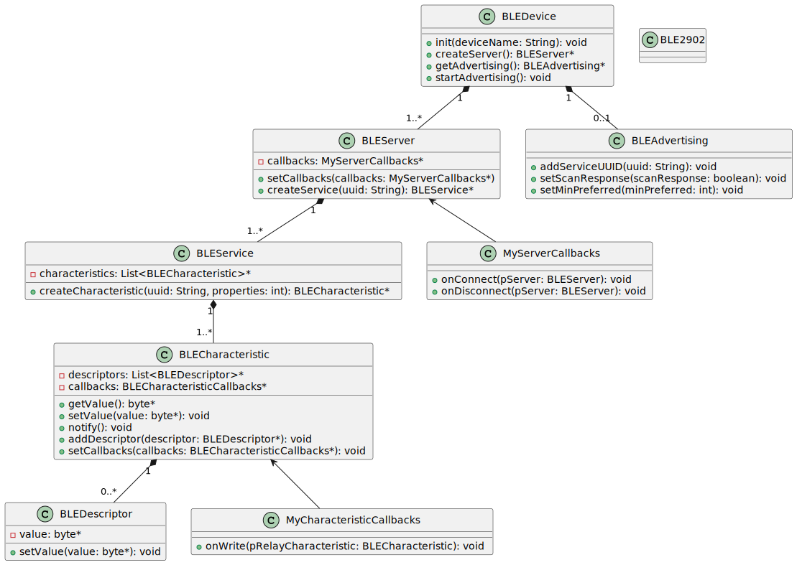

## IMPLEMENTATION OF A BLE COMMUNICATION WITH AN ESP32-H2 BOARD. 

The project includes: 
- The Arduino code for the BLE device.
- The code for a BLE2MQTT gateway in Python.

#### CLASS DIAGRAM ESP32

#### SEQUENCE DIAGRAM ESP32

#### SEQUENCE DIAGRAM PYTHON BLE2MQTT GATEWAY

